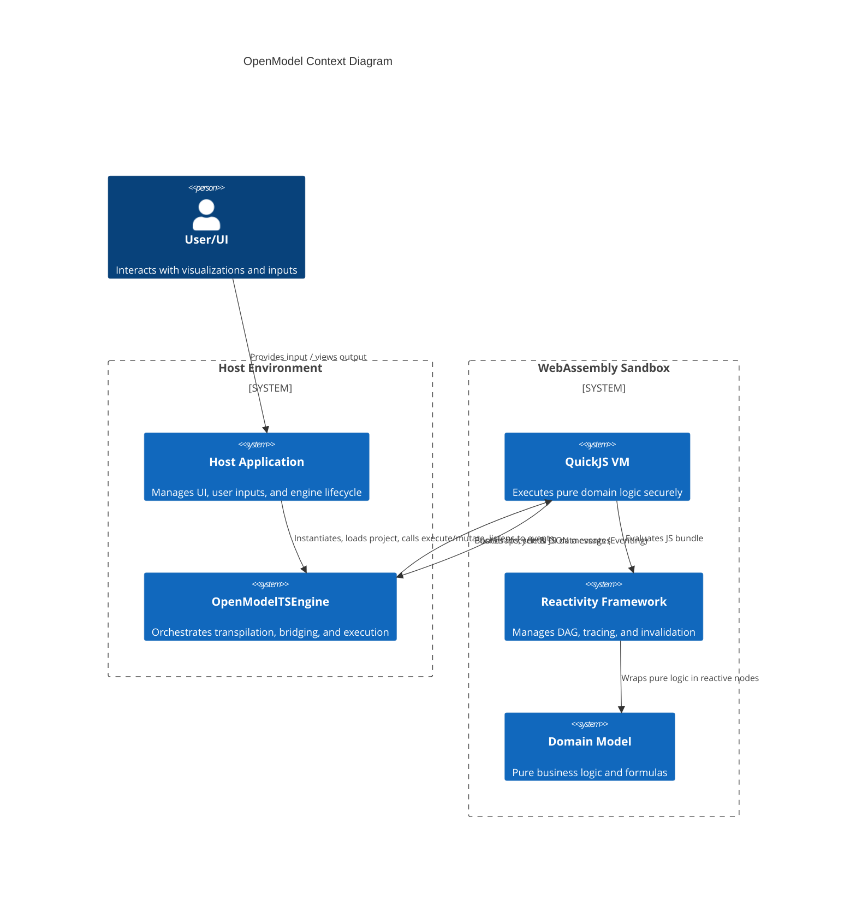

# System Architecture

## Overview

This document serves as the index and high-level architectural overview for the OpenModel TypeScript implementation.
The system provides a reactive, sandboxed execution environment (via QuickJS WASM) for running pure domain logic and
declarative models, separated from the host application.

## Business Terminology & Mental Model

To ensure alignment across the engineering team and architectural documentation, we define the following core concepts:

- **Host Environment:** The outer runtime (e.g., Node.js, Deno, or Browser) that manages the user interface, network
  requests, and the lifecycle of the sandboxed engine.
- **Engine (OpenModelTSEngine):** The wrapper around the WASM VM. It handles transpilation, sanitization, and
  serialization across the Host-VM boundary.
- **VM (Sandboxed Environment):** The QuickJS WebAssembly instance where the pure domain logic (the "Model") executes
  safely.
- **Directed Acyclic Graph (DAG):** The structural representation of dependencies between functions (Nodes) in the
  Model.
- **Node:** A discrete unit of execution within the DAG (e.g., an input variable, a calculation step, or an output
  rendering function).
    - **InputNode:** A source node providing external data from the Host.
    - **FunctionNode:** A pure business logic calculation node that produces new data and caches it in the trace.
    - **TermsNode:** A specialized container node used to instantiate a `TermsSet`. It acts as a namespace, skipping its
      own execution lifecycle events to allow granular, on-demand execution and tracing of its inner terms.
    - **OutputNode / ChartNode:** terminal UI-bound nodes that push data directly to the Host.
- **TermsSet:** A class-level definition of terms. When a class is marked with `@TermsSet`, all of its getter methods
  are implicitly treated as individual terms. Their results are tracked and cached specifically for that class instance,
  updating the global trace accordingly.
- **Thunk:** A zero-argument function that encapsulates the deferred execution of a Node.
- **Pull Phase (Discovery & Evaluation):** The process of requesting the output of a Node. If the DAG is unmapped, this
  phase discovers and registers dependencies. If the DAG is known but stale, it recalculates only the necessary paths.
  **Always returns a consolidated record of all workbook node results.**
- **Push Phase (Invalidation):** The process of signaling that an input Node has changed. This phase pushes a "stale"
  flag forward through the DAG edges without executing business logic.
- **Eventing System:** The communication bridge allowing the sandboxed VM to push lifecycle hooks (e.g., before/after
  calculation) and UI-ready data back to the Host Environment asynchronously.
- **Transparent Reactivity:** The framework's ability to intercept execution and track dependencies automatically
  without polluting the pure domain logic.

## High-Level Architecture

The following diagram illustrates the boundaries between the Host Application, the OpenModelTSEngine, and the Sandboxed
VM. It highlights the bidirectional communication: Host invoking execution, and the VM pushing events back via the
Eventing System.

## Related Specifications

- [OpenModelTSEngine Specification](./SPEC_OPEN_MODEL_TS_ENGINE.md) - Details the API, eventing model, internal
  sanitization rules, and the Hybrid Pull/Push reactivity mechanics of the execution engine.