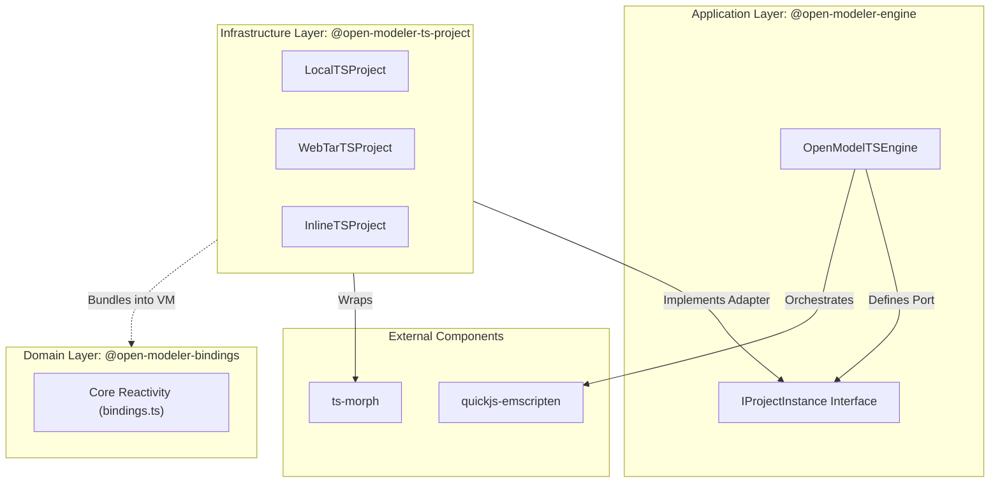
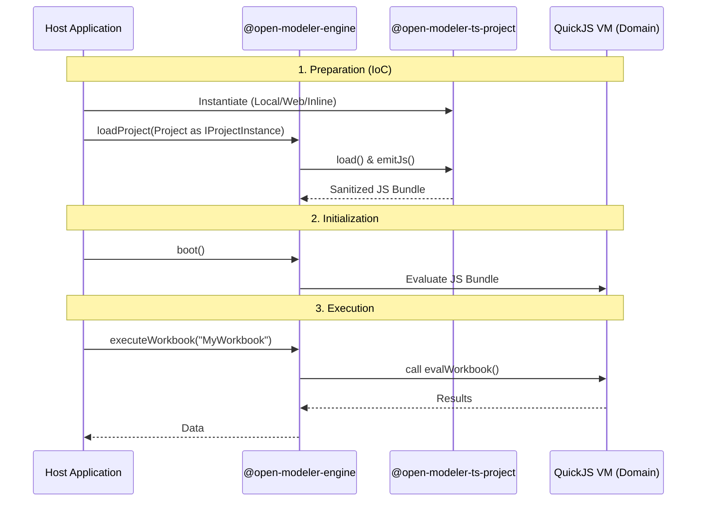

# System Architecture

## Overview

Open Modeler TypeScript is a high-performance execution engine designed to sandbox domain logic within a QuickJS
WebAssembly virtual machine. It employs a **Multi-Modular Architecture (MMA)** and follows **Domain-Driven Design
(DDD)** principles to ensure a decoupled, maintainable, and testable core.

## Multi-Modular Architecture (MMA)

The system is strictly partitioned into three logical modules, each with a dedicated **Public API (`index.ts`)**.
Interaction between modules is restricted to these entry points, preventing deep-linking and high coupling.

### Modules Dependency Diagram

### Module Roles (DDD Perspective)

1.  **Domain Layer (`@open-modeler-bindings`):**
    - The "Heart of the Software."
    - Contains pure reactivity logic and decorators.
    - Zero dependencies on other modules.
    - Maintained as a single file (`bindings.ts`) for maximum portability within the VM.

2.  **Application Layer (`@open-modeler-engine`):**
    - Orchestrates the collaboration between the Domain and Infrastructure.
    - Defines **Ports** (Interfaces like `IProjectInstance`) that Infrastructure must satisfy.
    - Manages the lifecycle of the QuickJS VM.

3.  **Infrastructure Layer (`@open-modeler-ts-project`):**
    - Handles technical concerns like file system access, network fetching, and transpilation.
    - Acts as an **Adapter**, satisfying the interfaces defined by the Application layer.

## Inversion of Control (IoC)

To achieve true decoupling, the `OpenModelTSEngine` does not depend on specific project loaders. Instead, it depends on
the `IProjectInstance` interface. This allows the engine to work with local files, remote archives, or in-memory strings
without modification.

## Module Aliases & Public API

Every module enforces a Public API pattern. External modules must only import from the root alias:

- `@open-modeler-bindings`: Core reactivity decorators and utilities.
- `@open-modeler-engine`: The main orchestrator and its configuration types.
- `@open-modeler-ts-project`: The various project sourcing strategies.

---

## Detailed Specifications

| Document                                                   | Description                                                                   |
| ---------------------------------------------------------- | ----------------------------------------------------------------------------- |
| [**OpenModelTSEngine Spec**](./ENGINE_SPEC.md)             | Application layer details, VM bridging, and Host-side API.                    |
| [**Bindings & Reactivity Spec**](./BINDINGS_SPEC.md)       | Domain layer details: DAG, Trace Store, and Pull/Push mechanics.              |
| [**TS Project Spec**](./TS_PROJECT_SPEC.md)                | Infrastructure layer details: Sourcing, transpilation, and manifest handling. |
| [**OpenModelTS Spec**](./OPEN_MODEL_TS_SPEC.md)            | Developer guide for modeling with decorators.                                 |
| [**Project Structure Spec**](./OPEN_MODEL_PROJECT_SPEC.md) | Requirements for `package.json` in Open Model projects.                       |
