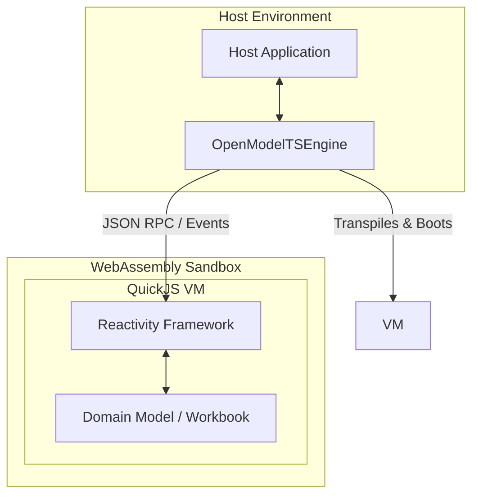
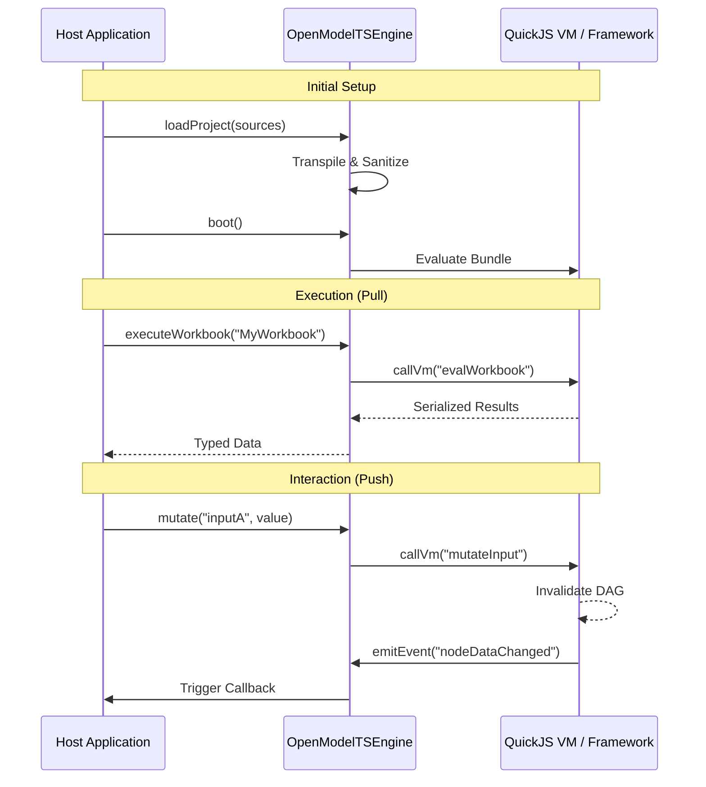

# System Architecture

## Overview

Open Modeler TypeScript is a high-performance, browser-ready execution engine designed to sandbox pure domain logic within a QuickJS WebAssembly (WASM) virtual machine. It provides a reactive environment where business models (Workbooks) are defined using standard TypeScript decorators, enabling transparent dependency tracking and efficient updates through a Directed Acyclic Graph (DAG).

## Business Terminology & Mental Model

- **Host Environment:** The outer runtime (Node.js, Browser) managing the UI and the lifecycle of the engine.
- **Engine (OpenModelTSEngine):** Orchestrates transpilation (via `ts-morph`), sanitization, and the Host-VM bridge.
- **VM (Sandboxed Environment):** The QuickJS WASM instance where domain logic executes securely.
- **Workbook:** A TypeScript class decorated with `@Workbook` that defines the reactive model.
- **Node:** A discrete unit of execution (Input, Function, or Sink).
- **TermsSet:** A specialized collection of lazily-evaluated terms for granular tracking.
- **Pull Phase:** The discovery and evaluation process that builds the DAG and memoizes results.
- **Push Phase:** The invalidation process that marks downstream nodes as "stale" when an input changes.
- **Transparent Reactivity:** The framework's ability to intercept property access to track dependencies automatically.

## High-Level Architecture

The system is divided into three primary layers: the **Host Application**, the **Engine Orchestrator**, and the **Sandboxed VM**.

## Communication Flow

The interaction between the Host and the VM follows a strict bridge pattern for security and predictability.

## Detailed Specifications

The architecture is further detailed in the following specialized documents:

| Document | Description |
| --- | --- |
| [**OpenModelTSEngine Spec**](./ENGINE_SPEC.md) | Details on transpilation, sanitization, VM bridging, and Host-side API. |
| [**Bindings & Reactivity Spec**](./BINDINGS_SPEC.md) | In-depth look at the DAG, Trace Store, Pull/Push mechanics, and Decorators. |
| [**OpenModelTS Spec**](./OPEN_MODEL_TS_SPEC.md) | Developer-facing guide on modeling patterns, decorators, and type safety. |
| [**Project Structure Spec**](./OPEN_MODEL_PROJECT_SPEC.md) | Requirements for `package.json` and file organization in an Open Model project. |
