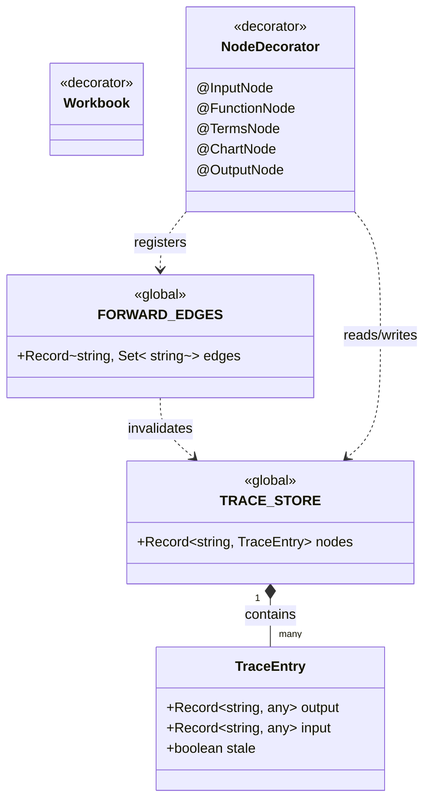
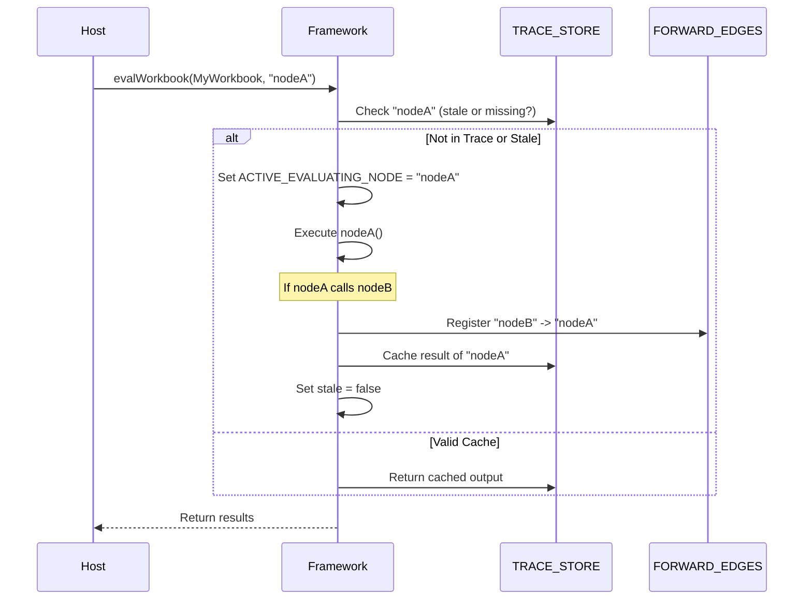
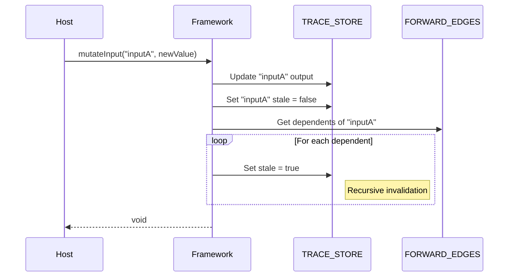

# UI Bindings & Reactivity Framework Specification

## Overview

The Reactivity Framework (Bindings) is the core execution engine within the QuickJS VM. It implements a hybrid Pull/Push
reactivity strategy through a Directed Acyclic Graph (DAG). It enables transparent dependency tracking, memoization (via
a Trace Store), and efficient invalidation, allowing pure domain models to be reactive without explicit boilerplate.

## Main Concepts

- **Directed Acyclic Graph (DAG):** The structural representation of dependencies between calculation nodes. Edges are
  automatically discovered during the first execution.
- **Node:** A discrete unit of execution.
    - **InputNode:** Source node for external data (e.g., user inputs). Triggers the Push Phase on change.
    - **FunctionNode:** Pure calculation node. Results are cached in the Trace Store.
    - **TermsNode:** Specialized container for `TermsSet` instances, allowing granular term tracking.
    - **Sink Nodes (@ChartNode, @OutputNode):** Terminal nodes that push data to the Host. They bypass the Trace Store
      cache to save memory.
- **Trace Store (`TRACE_STORE`):** A global registry within the VM that caches node outputs, inputs, and staleness
  flags.
- **Active Node Tracking:** A mechanism using a global pointer (`ACTIVE_EVALUATING_NODE`) to automatically map
  dependencies as nodes are accessed.
- **Pull Phase (Discovery & Evaluation):** Requesting a node's value. If the DAG is unknown, it discovers dependencies.
  If stale, it re-evaluates the minimal required path.
- **Push Phase (Invalidation):** Signaling that an InputNode has changed. It marks all downstream dependencies as "
  stale" without executing business logic.

## Structural Diagram

## Behavioral Diagram

### Pull Phase: Evaluation & Discovery

### Push Phase: Invalidation

## Components

### Reactivity Engine

The internal core responsible for `executeWithTracking`. It manages the `EVALUATION_STACK` for circular dependency
detection and coordinates with the `TRACE_STORE` and `FORWARD_EDGES`.

### Event Emitter

A bridge function (`emitEvent`) that serializes and sends execution lifecycle events (Before/After Node, Data Changed)
to the Host environment.

### Terms Proxy

A recursive Proxy handler created by `@TermsNode` that intercepts property access on `TermsSet` instances to enable
fine-grained reactivity for nested objects and lists.

## API Documentation

### Class Decorators

- **`@Workbook`**: Marks a class as a root container for reactive nodes.
- **`@TermsSet`**: Marks a class as a specialized container for terms (getters) that should be tracked granularly.

### Property Decorators

| Node Type       | Architectural Role | VM Trace Behavior     | Associated Events                                                | Description                                                                                                        |
|-----------------|--------------------|-----------------------|------------------------------------------------------------------|--------------------------------------------------------------------------------------------------------------------|
| `@InputNode`    | Source Node        | Cached in Trace       | `onNodeDataChanged`                                              | Captures user inputs from GUI. Use `mutate` to trigger change and push invalidation.                               |
| `@FunctionNode` | Calculation Node   | Cached in Trace       | `onBeforeNodeExecution`, `onAfterNodeExecution`               | Pure business logic computation. Memoizes results to prevent redundant calculation.                                |
| `@TermsNode`    | Container Node     | Bypasses Trace (Self) | `onBeforeTermExecution`, `onAfterTermExecution` (Inner terms) | Instantiates a `TermsSet`. Skips self-events; inner terms are cached granularly.                                   |
| `@ChartNode`    | Sink / Effect Node | **Bypasses Trace**    | `onNodeDataChanged`                                              | Evaluates data specifically for Chart rendering. Pushes data directly to the Host.                                 |
| `@OutputNode`   | Sink / Effect Node | **Bypasses Trace**    | `onNodeDataChanged`                                              | Evaluates data specifically for various output renderings (scalar, list, table). Pushes data directly to the Host. |

### Core Functions

- **`evalWorkbook(loader, nodeName?)`**: Evaluates a workbook and returns a consolidated record of node results.
- **`mutateInput(nodeName, data)`**: Updates an input node and invalidates its downstream dependencies.
- **`clearTrace()`**: Resets all caches and graph edges.
- **`getTopologicalOrder()`**: Returns nodes sorted by dependency order (requires full discovery).
