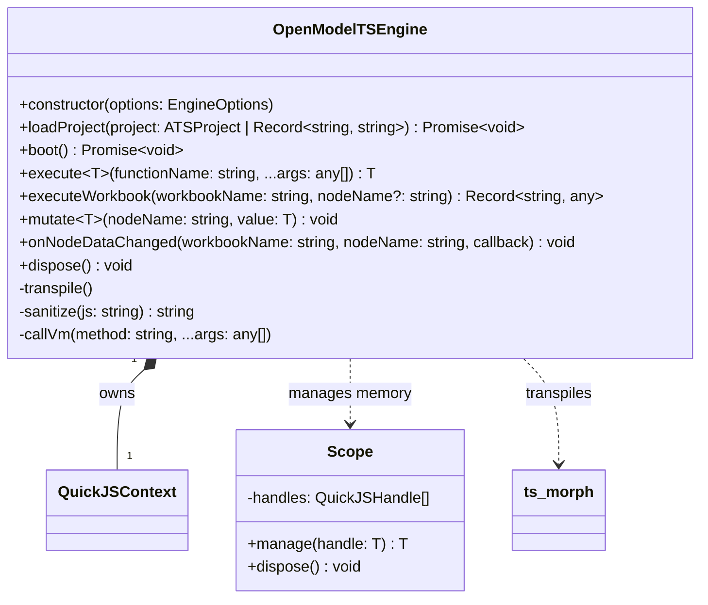
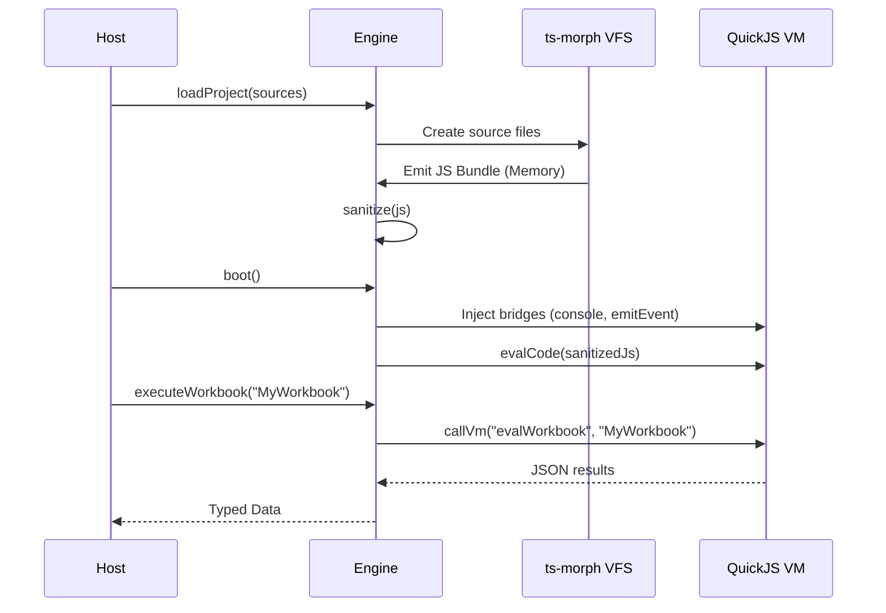

# OpenModelTSEngine Specification

## Overview

The `OpenModelTSEngine` is a robust, browser-ready orchestrator that sandboxes pure domain logic within a QuickJS WASM
virtual machine. It handles the full lifecycle of an OpenModel project: transpiling TypeScript source code in memory,
sanitizing it for a flat global scope, booting the VM, and providing a typed bridge for execution, mutation, and
asynchronous eventing.

## Main Concepts

- **Host vs. VM Boundary:** Clear separation between the outer runtime (Host) and the sandboxed execution (VM).
  Communication is serialized via JSON.
- **In-Memory VFS:** Uses `ts-morph` with a virtual file system to transpile TypeScript without physical disk access,
  ensuring portability to browsers.
- **Sanitization Pipeline:** Strips module systems (ESM/CJS) and "use strict" directives from transpiled code to adapt
  it for the VM's global environment.
- **Bridge Functions:** Specialized Host-side functions injected into the VM (e.g., `console.log`, `__emitEvent`) to
  enable bidirectional communication.
- **Asynchronous Eventing:** A mechanism to push VM lifecycle hooks (e.g., node execution start/end) and UI-ready data
  back to the Host without blocking the calculation thread.
- **VM Reference (`VmRef`):** A lightweight handle to a variable already existing in the VM's global scope, avoiding
  redundant serialization of large structures like Workbook classes.

## Structural Diagram

## Behavioral Diagram

### Lifecycle: From Source to Execution

## Components

### Transpiler (ts-morph)

Manages the in-memory compilation of TypeScript. It resolves internal dependencies and produces a unified JavaScript
bundle optimized for the VM.

### Sanitizer

A regex-based post-processor that transforms standard TypeScript/JavaScript output into a "flat" format compatible with
the VM's global scope (e.g., converting `export const` to `var`).

### VM Bridge (QuickJS)

The interface layer that manages `QuickJSHandle` lifecycles through a `Scope` class, ensuring no memory leaks occur
during Host $\leftrightarrow$ VM transitions.

### Event Handler

Captures `__emitEvent` calls from the VM and routes them to registered Host-side listeners, enabling real-time updates
for UI components.

## API Documentation

### Initialization & Lifecycle

- **`constructor(options?: EngineOptions)`**: Initializes the engine. `debug` option enables verbose logging.
- **`loadProject(project: ATSProject | Record<string, string>)`**: Prepares the VM bundle. Consumes pre-transpiled code
  from `ATSProject` or sources from a raw file map.
- **`boot()`**: Bootstraps the QuickJS environment and evaluates the project code.
- **`dispose()`**: Cleans up VM resources and handles.

### Execution

- **`execute<T>(functionName: string, ...args: any[]): T`**: Invokes a global VM function.
- **`executeWorkbook(workbookName: string, nodeName?: string)`**: Executes a specific workbook or node. Uses `VmRef`
  internally.
- **`mutate<T>(nodeName: string, value: T)`**: Updates an `@InputNode` and triggers invalidation.

### Event Listeners

- **`onNodeDataChanged(workbook, node, callback)`**: Triggered when a node's data is updated (Sink Nodes or Inputs).
- **`onBeforeNodeExecution(workbook, node, callback)`**: Triggered before a node calculates.
- **`onAfterNodeExecution(workbook, node, callback)`**: Triggered after a node calculates.
- **`onBeforeTermExecution(workbook, node, callback)`**: Triggered before a term in a `TermsSet` calculates.
- **`onAfterTermExecution(workbook, node, callback)`**: Triggered after a term in a `TermsSet` calculates.
