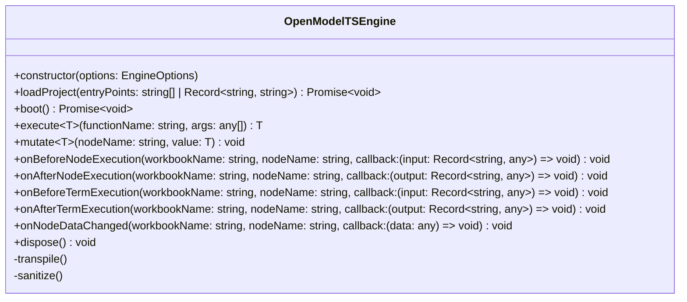
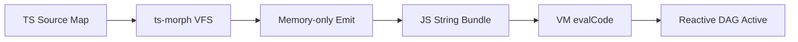
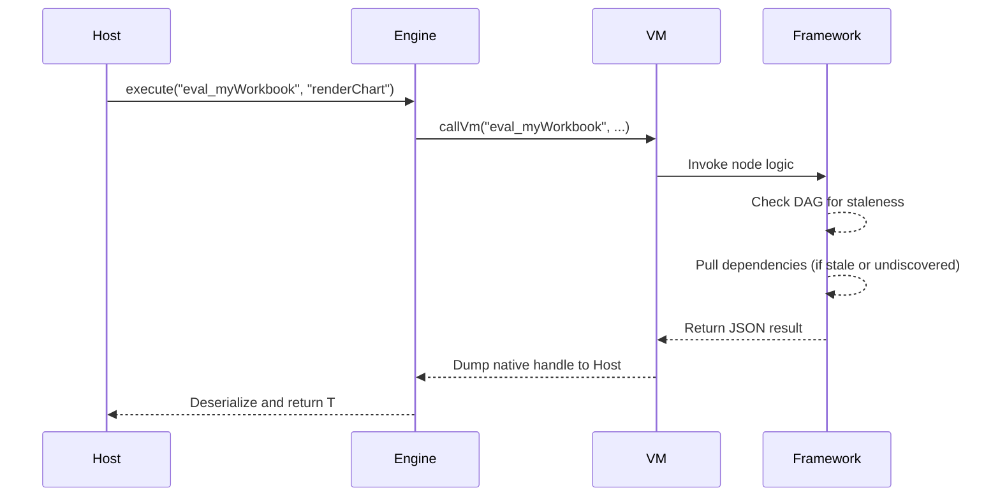
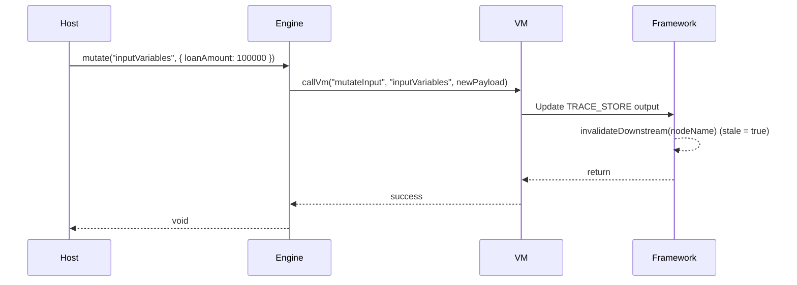

# OpenModelTSEngine Specification

The `OpenModelTSEngine` is a robust wrapper around the QuickJS WASM VM, designed to execute OpenModel TypeScript
projects in a sandboxed environment. It handles transpilation, environment bootstrapping, and safe communication between
the host and the VM.

## Architectural Overview

The engine performs the following steps:

1. **Transpilation**: Uses `ts-morph` to convert TypeScript source files into a single compatible JavaScript bundle.
2. **Sanitization**: Post-processes the transpiled JS to remove module systems (ESM/CommonJS) and adapt it for a flat
   global scope.
3. **Bootstrapping**: Initializes the QuickJS VM, sets up host bridges (e.g., `console.log`, event emitters), and
   evaluates the
   sanitized JS.
4. **Execution & Eventing**: Provides a typed interface to call functions, mutate inputs, and listen to asynchronous
   lifecycle events (Host $\leftrightarrow$ VM).

## API Reference

### Structural Diagram



### `class OpenModelTSEngine`

#### `constructor(options?: EngineOptions)`

Initializes a new instance of the engine.

- `options.debug`: (Optional) Enable verbose logging of transpilation and VM steps.

#### `async loadProject(entryPoints: string[] | Record<string, string>): Promise<void>`

Transpiles the provided TypeScript files and prepares the internal JavaScript bundle.

- `entryPoints`:
    - **Node/Deno:** An array of file paths.
    - **Browser/Virtual:** A record mapping virtual file paths to source code strings (e.g., `{ "/main.ts": "..." }`).
- The engine resolves dependencies within the provided virtual or physical scope and emits a unified JavaScript string
  directly to memory.

#### `async boot(): Promise<void>`

Initializes the QuickJS environment and evaluates the prepared JavaScript bundle. Must be called before `execute`.

#### `execute<T = any>(functionName: string, ...args: any[]): T`

Calls a global function defined in the loaded project.

- `functionName`: The name of the function to invoke.
- `args`: Arguments to pass to the function. Complex objects are serialized via JSON.
- Returns the result of the function call, deserialized from the VM.

#### `mutate<T>(nodeName: string, value: T): void`

Host-side trigger to update the payload of an input node. This explicitly injects new external data into the sandboxed
environment and initiates the **Push Phase** (invalidation).

- `nodeName`: The exact identifier of the node within the `TRACE_STORE` (e.g., `'inputVariables'`).
- `value`: The new, raw data payload to assign to this node's output trace. The shape of `value` **must exactly match**
  the expected output shape of the node being mutated. The engine serializes this `value` to JSON and sends it into the
  VM, bypassing the node's original evaluator function to substitute its result directly.

#### `executeWorkbook(workbookName: string, nodeName?: string): Record<string, any>`

Evaluates a specific workbook.

- `workbookName`: The name of the workbook thunk to execute.
- `nodeName`: (Optional) The specific node to pull. If omitted, performs a "Full Pull" on all nodes.
- **Returns:** A `Record<string, any>` containing results for **all** nodes defined in the workbook.
    - If `nodeName` is provided, it returns the requested result plus any existing cached results for other nodes.
    - Nodes that haven't been evaluated yet will be `undefined` in the record.

### Event Listener Methods (Under Design)

The `OpenModelTSEngine` provides asynchronous event listeners to bridge the VM execution lifecycle back to the Host
Environment.

*Architectural Note: These methods represent the state-of-the-art eventing design currently being finalized.*

####

`onBeforeNodeExecution(workbookName: string, nodeName: string, callback: (input: Record<string, any>) => void): void`

- **Purpose:** Intercepts the execution flow immediately before a pure calculation `@FunctionNode` evaluates.
- **Payload (`input`):** The fully resolved dependency object (arguments) that will be passed to the node's function.
- **Use Case:** Profiling execution start times, debugging dependency resolution, or triggering "loading" states in the
  UI for heavy formulas.

####

`onAfterNodeExecution(workbookName: string, nodeName: string, callback: (output: Record<string, any>) => void): void`

- **Purpose:** Intercepts the execution flow immediately after a pure calculation `@FunctionNode` evaluates
  successfully.
- **Payload (`output`):** The resulting named output object produced by the node.
- **Use Case:** Telemetry, auditing business logic results, or caching intermediate calculation states without binding
  them directly to UI components.

####

`onBeforeTermExecution(workbookName: string, nodeName: string, callback: (input: Record<string, any>) => void): void`

- **Purpose:** Intercepts the execution flow immediately before a specific term within a `@TermsNode` evaluates.
- **Payload (`input`):** Usually an empty object, as terms derive their input from the parent container.
- **Use Case:** Profiling granular term evaluation within complex structures.

####

`onAfterTermExecution(workbookName: string, nodeName: string, callback: (output: any) => void): void`

- **Purpose:** Intercepts the execution flow immediately after a specific term within a `@TermsNode` evaluates.
- **Payload (`output`):** The resulting data (scalar or object) produced by the term.
- **Use Case:** Monitoring the fine-grained data flow of individual terms.

#### `onNodeDataChanged(workbookName: string, nodeName: string, callback: (data: any) => void): void`

- **Purpose:** The primary bridge for UI reactivity. Triggered when a Sink Node (`@ChartNode`, `@OutputNode`)
  receives new upstream data or an `@InputNode` is updated.
- **Payload (`data`):** The raw data ready for visualization or UI consumption.
- **Use Case:** Triggering state updates in the Host Application (e.g., React `setState`) to re-render charts, tables,
  or update input forms dynamically.

---

### Strategy & Reasoning: The `mutate` API

The `mutate` method is the critical communication bridge for reacting to user input in the Host Environment without
tearing down the VM or re-transpiling the model.

**Why does it accept exactly `value: T`?**
The Host-side engine should remain entirely agnostic to the internal abstractions of specific node implementations (such
as wrapping arrays into `{ rows }` structures). By mandating that `mutate` receives the exact data structure expected by
the node's dependents, we decouple the host engine from the domain framework logic. The inner `mutateInput` framework
function directly overwrites the cached output of the target node in the `TRACE_STORE` with the provided `value`.

---

## Execution Strategy: In-Memory (No-FS) Operations

To ensure compatibility with modern browsers (Chrome, Edge, Safari) and restricted environments, the `OpenModelTSEngine`
operates entirely in memory.

### 1. Virtual File System (VFS) Transpilation

The engine uses `ts-morph` with an in-memory file system. This allows it to:

- Resolve imports between virtual files without hitting the disk.
- Emit a single JavaScript bundle as a string via `emitToMemory()`.
- Completely avoid the overhead and security constraints of temporary file creation (`tmp/`).

### 2. Streamlined Evaluation

Once the JS bundle is generated, it is passed directly to `vm.evalCode(jsCode)`. This string-based transfer is the only
bridge required to bootstrap the sandboxed environment.



---

## Reactivity & Execution Strategy

To maintain pure model definitions while enabling high-performance updates, the engine implements a **Hybrid Pull/Push
Reactivity** model (Transparent Reactivity).

### Behavioral Diagrams

**Pull Phase: DAG Discovery & Execution**



**Push Phase: Invalidation**



### 1. The Pull Phase (DAG Discovery)

The first execution of any output node (e.g., a ChartNode or OutputNode) triggers a "Discovery Pull":

- **Transparent Tracking**: Uses "Call Stack Interception" via a global `ACTIVE_EVALUATING_NODE` pointer.
- **DAG Construction**: As nodes are invoked, the framework automatically maps forward edges (Source $\rightarrow$
  Dependent) in a `FORWARD_EDGES` registry.
- **Memoization**: Results are cached in `TRACE_STORE` to avoid redundant calculations.

### 2. The Push Phase (Invalidation)

When data changes via `mutate()`, the engine pushes a "Stale" signal:

- **Fast Invalidation**: Flips a `stale: true` flag forward through the `FORWARD_EDGES` graph ($O(V+E)$ traversal).
- **Lazy Re-evaluation**: No business logic is executed during the push phase; nodes are merely marked for future
  calculation.

### 3. Targeted Re-evaluation

Subsequent host requests for data (Pulls) only execute nodes marked as `stale`. This ensures that only the minimal
required path of the DAG is recomputed.

## Internal Sanitization Rules

To ensure compatibility with the flat global scope of the VM, the engine applies the following transformations:

- Removal of `"use strict";` directives.
- Conversion of `const TRACE_STORE` to `var` for global access if necessary.
- Removal of `export` and `import` statements.
- Removal of CommonJS artifacts (`require`, `exports`, `Object.defineProperty`).
- Stripping of module prefixes generated by the TypeScript compiler (e.g., `(0, bindings_ts_1.FunctionNode)` becomes
  `FunctionNode`).

## Example Usage

### 1. Initialization and Initial Pull

```typescript
const engine = new OpenModelTSEngine();

// Load from memory (Browser-friendly)
await engine.loadProject({
    "/main.ts": "import { FunctionNode } from './bindings'; ...",
    "/bindings.ts": "..."
});

await engine.boot();

// Initial evaluation: Builds the DAG and returns data
const initialTable = engine.execute("eval_myWorkbook", "renderLoanScheduleTable");
console.log("Initial Rows:", initialTable.length);
```

### 2. Reactive Mutation (Push Phase)

```typescript
// Update an input variable - this triggers the Push (Invalidation) Phase
engine.mutate("inputVariables", {
    loanAmount: 150000, // Changed from 100000
    interestRate: 0.05,
    loanTerm: 30
});

// Targeted Pull: Only re-calculates the stale path
const updatedTable = engine.execute("eval_myWorkbook", "renderLoanScheduleTable");
console.log("Updated Rows:", updatedTable.length);

engine.dispose();
```

## Dependencies

- `ts-morph`: For TypeScript transpilation.
- `quickjs-emscripten`: For the WASM-based JS VM.
- `deno.land/std/path`: For path resolution.
