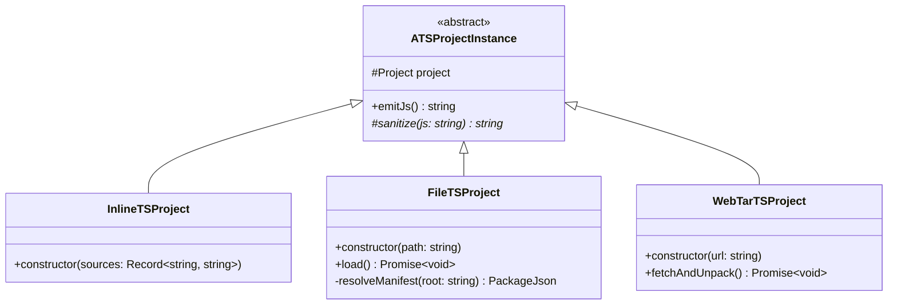
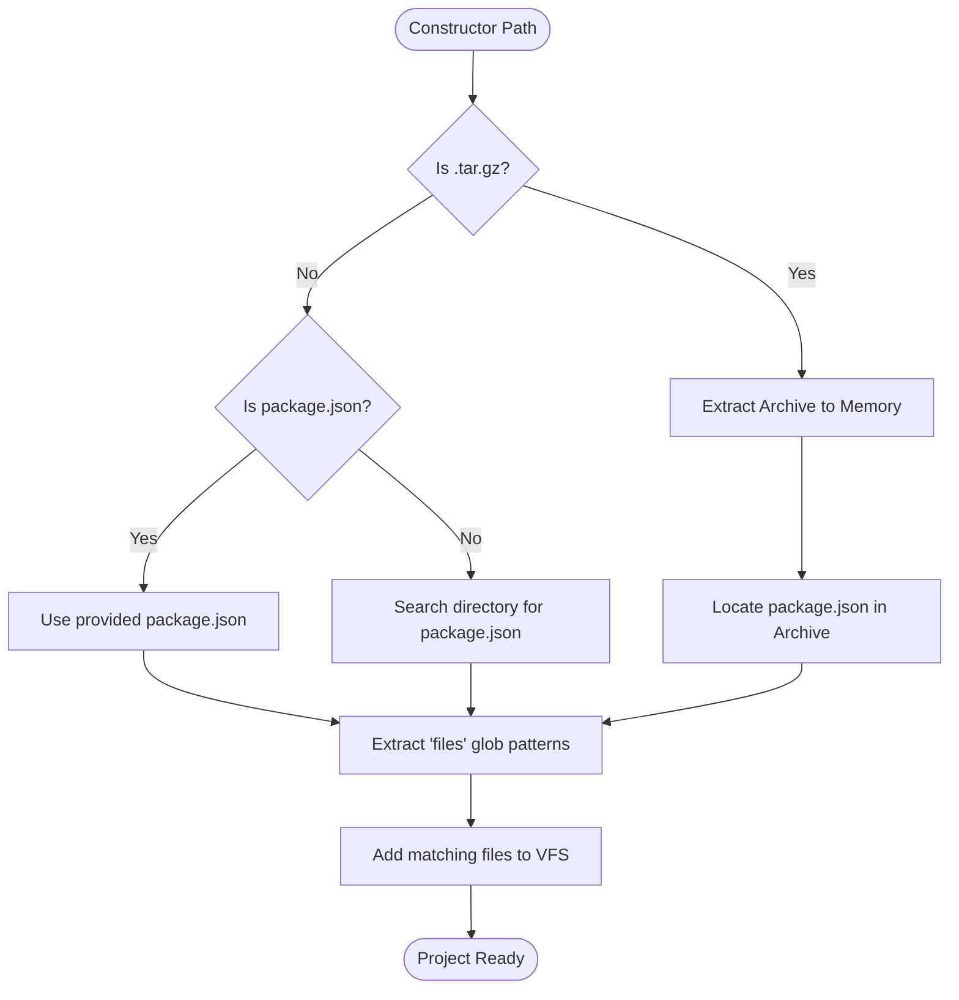

# TypeScript Project Instance Specification

## Overview

The `ts-project` module provides a unified abstraction for managing, transpiling, and bundling TypeScript source files.
It wraps the `ts-morph` engine to provide a consistent interface for different project sourcing strategies (e.g.,
in-memory strings, local file systems, or remote archives) and produces a sanitized JavaScript bundle required by the
`OpenModelTSEngine`.

## Main Concepts

- **Abstract Project Instance (`ATSProjectInstance`):** The core base class that manages the internal `ts-morph`
  project, compiler options, and the emit/sanitization pipeline.
- **Manifest-Driven Sourcing:** Utilizes the `package.json` manifest as the authoritative source of truth for the
  project scope (via the `files` array).
- **Virtual File System (VFS):** All project instances are loaded into an in-memory `ts-morph` environment to ensure
  cross-platform compatibility.
- **Unified Local Resolution:** `FileTSProject` acts as a polymorphic loader that resolves both raw directory structures
  and compressed archives using the same manifest logic.

## Structural Diagram

## Behavioral Diagram

### FileTSProject Resolution Logic

The `FileTSProject` employs a hierarchical resolution strategy to identify the project root and the subset of files to
be included in the transpilation bundle.

## Components

### `ATSProjectInstance` (Abstract)

The foundational class containing the logic for `ts-morph` initialization and JavaScript bundling. It handles the shared
sanitization logic required to flatten the JS bundle for the QuickJS VM.

### `InlineTSProject`

Designed for scenarios where source code is already available as strings. Ideal for browser-based editors or dynamically
generated models.

### `FileTSProject`

A unified loader for local assets. It follows these rules:

1. **Path Resolution:** If provided a directory, it searches for a `package.json`. If provided a full path to a
   `package.json`, it uses it directly.
2. **Archive Handling:** If the path points to a `.tar.gz` file, it extracts the archive into memory first.
3. **Manifest Authority:** Regardless of the source (raw files or archive), it **must** read the `package.json` and use
   the `files` field to determine which source files are included in the virtual project instance.

### `WebTarTSProject`

Designed for remote runtime execution. It fetches a `.tar.gz` from a URL (e.g., GitHub Releases), extracts it, and then
follows the same manifest-driven logic as `FileTSProject` to populate the VFS.

## API Documentation

### The `package.json` Contract

`FileTSProject` and `WebTarTSProject` strictly adhere to the `package.json` fields defined in
`OPEN_MODEL_PROJECT_SPEC.md`:

- **`files`**: An array of glob patterns or file paths. Only files matching these patterns are added to the internal
  `ts-morph` project.
- **`exports`**: Used to identify the primary entry points for the model execution.
