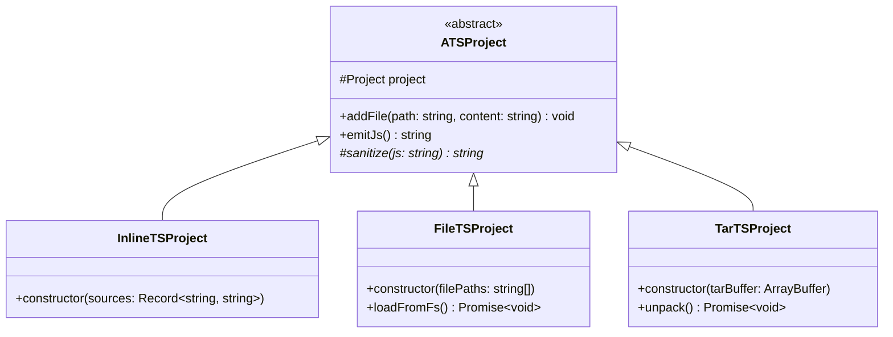
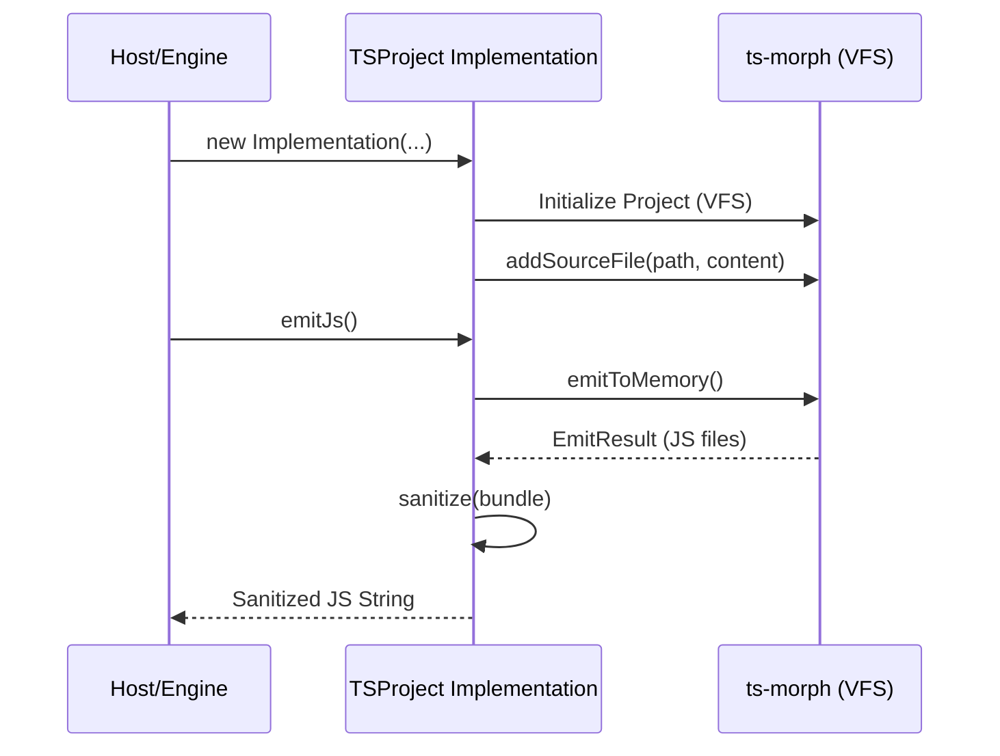

# TypeScript Project Abstraction Specification

## Overview

The `TSProject` module provides a unified abstraction for managing, transpiling, and bundling TypeScript source files.
It wraps the `ts-morph` engine to provide a consistent interface for different project sourcing strategies (e.g.,
in-memory strings, physical files, or compressed archives) and produces a sanitized JavaScript bundle required by the
`OpenModelTSEngine`.

## Main Concepts

- **Abstract Project (`ATSProject`):** The core base class that manages the internal `ts-morph` project, compiler
  options, and the emit/sanitization pipeline.
- **Virtual File System (VFS):** All project types utilize an in-memory file system to ensure portability across
  environments (Browser, Node.js).
- **Source Sourcing:** Specialized implementations handle the retrieval and injection of source code into the VFS.
- **Sanitized Emit:** The process of compiling TypeScript into a single JavaScript string and applying transformations
  to ensure compatibility with the VM's global scope.

## Structural Diagram

## Behavioral Diagram

### Project Loading and Transpilation

## Components

### `ATSProject` (Abstract)

The foundational class containing the logic for `ts-morph` initialization and JavaScript bundling. It defines the
`emitJs` method which orchestrates the compilation and post-processing (sanitization).

### `InlineTSProject`

Designed for scenarios where source code is already available as strings (e.g., web IDEs, dynamic model generation). It
accepts a map of file paths to code.

### `FileTSProject`

Used in server-side environments (Node.js) to load source files directly from the physical disk into the virtual
project.

### `TarTSProject`

Facilitates the distribution of models as compressed `.tar` files. It unpacks the archive in memory and populates the
project with the extracted contents.

## API Documentation

### `ATSProject` Methods

- **`emitJs(): string`**: Triggers the TypeScript compilation and returns a unified, sanitized JavaScript string.
- **`addFile(path: string, content: string): void`**: Manually injects a file into the project's virtual file system.
- **`getProject(): Project`**: Provides direct access to the underlying `ts-morph` Project instance for advanced
  manipulations.

### Implementation Specifics

| Class             | Primary Input            | Use Case                                      |
| ----------------- | ------------------------ | --------------------------------------------- |
| `InlineTSProject` | `Record<string, string>` | Browser-based editors, simple dynamic models. |
| `FileTSProject`   | `string[]` (paths)       | CLI tools, server-side execution.             |
| `TarTSProject`    | `ArrayBuffer / Buffer`   | Porting complex projects as single artifacts. |
