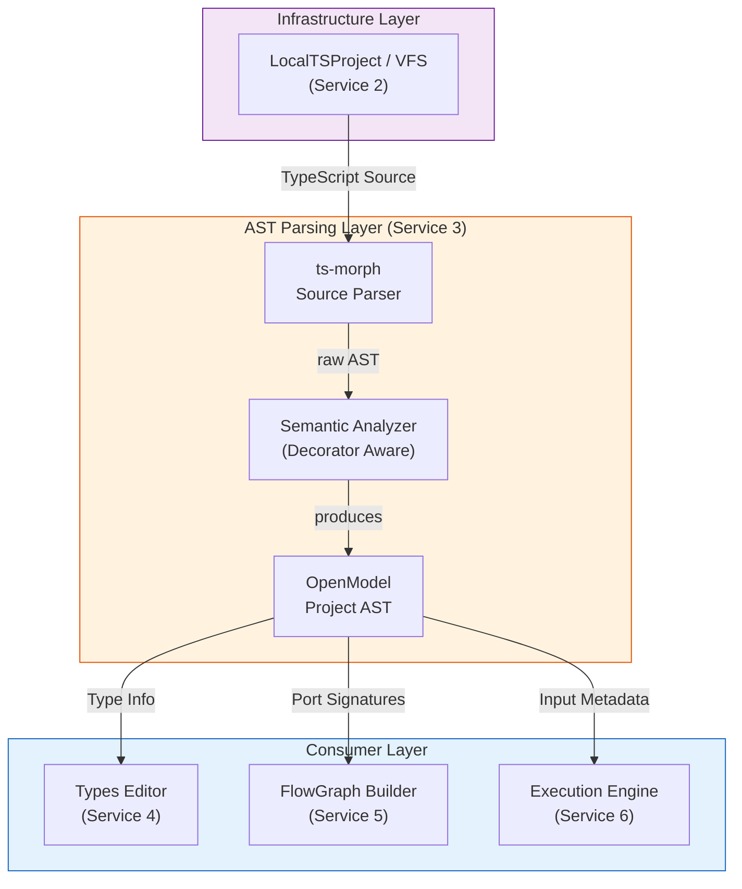
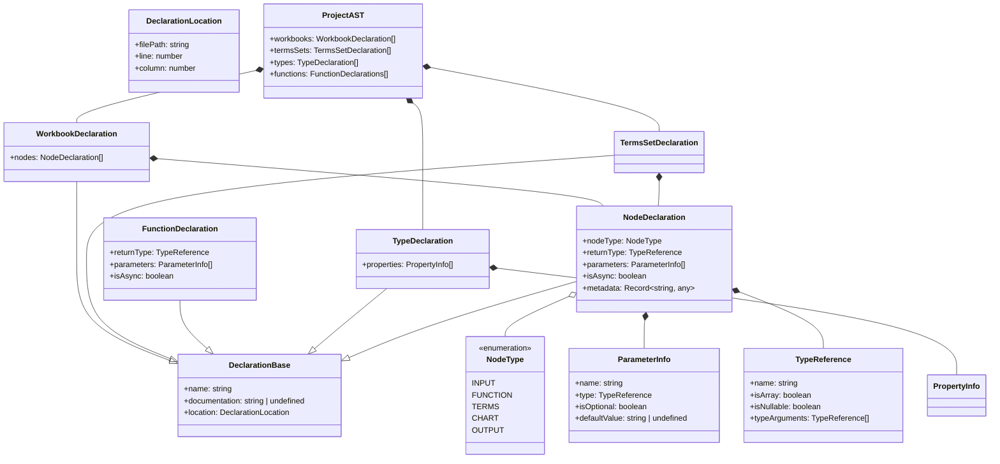

# AST Parsing Specification

[project-ast](../../src/project-ast)

## Overview

The AST Parsing service defines the intermediate representation (`ProjectAST`) used to bridge TypeScript source code and
all downstream consumers. The AST is produced by **ts-morph** during the Analysis Phase and serves as the single source
of truth for the project's reactive structure.

In Open Modeler, the AST is not just a generic code tree; it is a **Semantic Model** that understands our `@Workbook`
and `@Node` decorators. It translates raw TypeScript class members into a structured graph representation suitable for
ReactFlow and the Execution Engine.

## Main Concepts

- **Types Editor** and **Flow Editor** are external components (consumers) that are developed using React and ReactFlow.

## Architectural Views

### 1. Analysis & Transformation Pipeline

The AST Parsing layer acts as the **Domain Parser**. It consumes raw source from the Infrastructure layer (Service 2)
and produces a structured `ProjectAST` that the Flow Modeling layer (Service 5) uses to generate the visual graph.

## AST Structural Diagram

The `ProjectAST` is organized around the concept of **Workbooks** (containers) and **Nodes** (reactive units).

## Node Mapping Rules

The AST Parser identifies nodes by inspecting TypeScript decorators.

| Decorator       | AST `nodeType` | Description                                                               |
| :-------------- | :------------- | :------------------------------------------------------------------------ |
| `@InputNode`    | `INPUT`        | Source nodes. Maps to `Input` ports in ReactFlow.                         |
| `@FunctionNode` | `FUNCTION`     | Calculation nodes. Maps to standard `Processing` nodes.                   |
| `@TermsNode`    | `TERMS`        | Container nodes. Maps to `Sub-graph` or `Group` anchors.                  |
| `@ChartNode`    | `CHART`        | Sink nodes. Contains additional `metadata` for chart config (type, axes). |
| `@OutputNode`   | `OUTPUT`       | Sink nodes. Used for final results and UI table rendering.                |

## Round-Trip Requirements

The AST Parsing service must support **Surgical Updates**:

- When a user changes a node name in the Flow Editor, the service must update the corresponding property name in the
  `.ts` file using `ts-morph` without destroying formatting.
- When a new node is added to the graph, a new decorated property must be injected into the `Workbook` class.
