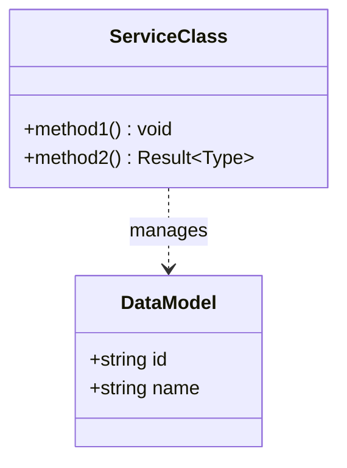
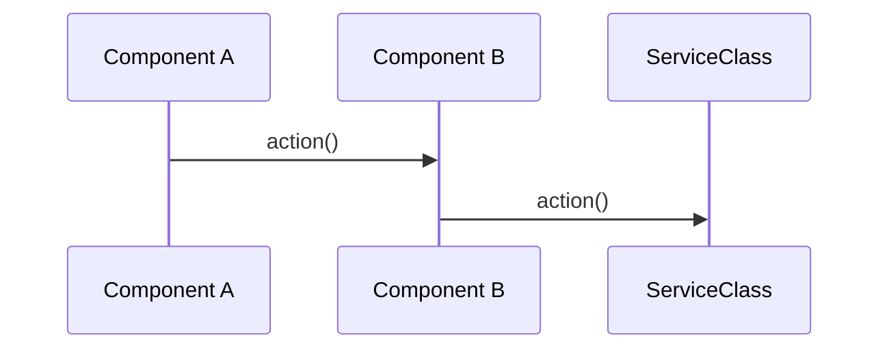

# _Module N_ Specification

## Overview

_Brief high-level description of the module's responsibility and its role in the system._

## Main Concepts

_Main concepts that this module introduces, e.g. key patterns, or architectural principles. This section
should provide enough but brief context for an Agent with decision solutions and software engineering background.
Concepts are listed in bullet points_

## Structural Diagram

_Optional section to illustrate the main classes and data models of the module and their relationships._

## Behavioral Diagram

_Optional section to illustrate the flow of a key action or feature that this module implements. For high level data
flow use Mermaid Flow diagrams and for interactions between components use Sequence diagrams. Sequence diagram actors
are components or subcomponents and interactions are method calls. Use `Note over` if necessary_

## Components

### _Component Name A_

_Description of the component's responsibility._

### _Component Name B_

_Description of the component's responsibility._

## API Documentation

_Brief documentation of all public methods or other exports of the component or components. For example, if the new
module exports TypeScript annotations (decorators) to be used in the user code, this section should list all of them
with a brief description. Try using compact representation approaches, such as bullet points or tables, to keep it
concise and scannable. If it is possible, extract categories of exports and present them in the table as well._
